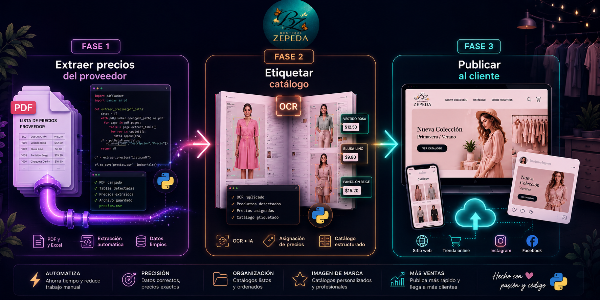

# books-label

**Herramienta de etiquetado de catálogos — Boutique Zepeda**

---

## ¿Qué hace este proyecto?

`books-label` tiene dos objetivos en secuencia:

1. **Etiquetar catálogos.** Toma los catálogos PDF de los proveedores y les estampa los precios propios de la boutique mediante OCR y una tabla de precios en Excel. El resultado es un PDF listo para distribuir al cliente.

2. **Desplegar los catálogos etiquetados a un canal de venta.** Este segundo objetivo está en definición. Las opciones evaluadas son GitHub Pages (visualización directa desde el repositorio) y un portal web desplegado en Vercel. El canal actual — Dropbox + WhatsApp Business — seguirá operando mientras se resuelve esta etapa.

---

## Equipo

| Persona | Rol |
|---------|-----|
| Gabriel | Desarrollo y mantenimiento técnico |
| Sonia   | Operación: preparación de precios, etiquetado y publicación |

Sonia trabaja exclusivamente con paneles HTML y consola — sin editar código ni archivos de configuración a mano.

---

## Flujo de trabajo

<div align="center">
  
</div>

La guía operativa completa para Sonia está en [`docs/CHECKLIST.md`](docs/CHECKLIST.md).

---

## Estructura del proyecto

```
books-label/
│
├── scripts/
│   ├── catalogo_base.py      # Script principal — núcleo del proyecto
│   └── diagnostico.py        # Diagnóstico de resultados por corrida
│
├── configs/
│   ├── config_base.json      # Plantilla base de configuración
│   └── configurador.html     # Panel visual para Sonia (genera el JSON)
│
├── precios/
│   └── tabla_precios.ods     # Libro de precios — propiedad de Sonia
│
├── libros/                   # Catálogos PDF de entrada (sin versionar)
├── salidas/                  # PDFs etiquetados generados (sin versionar)
├── diagnosticos/             # Logs de cada corrida con timestamp
│
├── imagenes/
│   ├── logos/                # Logo de la boutique y carátulas institucionales
│   └── asset_repo/           # Capturas para la documentación
│
├── docs/
│   ├── CHECKLIST.md          # Guía operativa paso a paso para Sonia
│   ├── SETUP.md              # Configuración inicial del entorno
│   ├── DIAGNOSTICO.md        # Referencia del sistema de diagnóstico
│   └── GIT-ESENCIAL.md       # Git mínimo necesario para el equipo
│
├── prompts/
│   └── extraer_columnas_listas.md   # Prompt de IA para Fase 1
│
├── sync.sh                   # Sincronización Git entre Gabriel y Sonia
├── requirements.txt          # Dependencias Python
└── README.md
```

> `libros/` y `salidas/` no se versionan — contienen archivos de trabajo locales.
> `venv_catalogo/` tampoco se versiona — cada máquina lo recrea con `SETUP.md`.

---

## Inicio rápido

**Primera vez en esta máquina** — seguir [`docs/SETUP.md`](docs/SETUP.md).

**Uso diario:**

```bash
# 1. Sincronizar antes de trabajar
./sync.sh

# 2. Activar el entorno
source venv_catalogo/bin/activate

# 3. Abrir el configurador visual
xdg-open configs/configurador.html

# 4. Ejecutar el etiquetado
python3 scripts/catalogo_base.py --config configs/<nombre_config>.json

# 5. Sincronizar al terminar
./sync.sh
```

---

## Proveedores soportados

| Proveedor   | Formato de ID    | Estado           |
|-------------|------------------|------------------|
| Price Shoes | `ID xxxxxxx`     | ✅ Activo        |
| Pakar       | `Código xxx-xxx` | 🔧 En desarrollo |
| Cklass      | `xxx-xx`         | 🔧 En desarrollo |

El formato de cada proveedor se declara en `config_base.json`. Agregar un proveedor nuevo no requiere modificar el script.

---

## Sincronización entre máquinas

Gabriel y Sonia trabajan sobre el mismo repositorio desde máquinas distintas. El script `sync.sh` maneja la sincronización con las siguientes reglas:

- `tabla_precios.ods` siempre conserva la versión de Sonia.
- Los conflictos en otros archivos se reportan y deben resolverse manualmente.
- El commit incluye automáticamente quién sincronizó y qué archivos cambió.

```bash
./sync.sh   # bajar cambios + subir los propios
```

---

*books-label · Boutique Zepeda · 2026*
