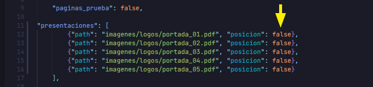

# ✨ Guía de Etiquetado — Boutique Zepeda

> Cada catálogo que etiquetas aquí es uno menos a mano.
> Sigue los pasos en orden y el proceso se cuida solo.

---

## 🗺️ ¿Dónde estoy en el proceso?

```
FASE 1          FASE 2          FASE 3
Preparar   →   Etiquetar   →   Publicar
precios         catálogo        en WA
```

---

## 📋 FASE 1 — Preparar los precios

> Objetivo: tener el archivo Excel listo antes de tocar el script.

### Descargar y verificar

- [ ] Descargar el catálogo PDF y la lista de precios del proveedor.
- [ ] Validar visualmente que el catálogo y la lista coincidan: número de páginas, IDs y precios sugeridos.
- [ ] Mover ambos archivos a: `~/boutique_zepeda/<proveedor>/catalogos` y `~/boutique_zepeda/<proveedor>/lista_precios` respectivamente.

### Extraer los precios con LLM *(solución temporal — se evalúa script.py como alternativa más precisa)*

- [ ] Elige un LLM: NotebookLM, Claude, o ambos en paralelo. 📎 Adjunta la lista cruda del proveedor.
- [ ] Abrir el prompt de extracción: 👉 [magic-town/books-label](../prompts/extraer_columnas_listas.md)
- [ ] Pegar el prompt en el LLM y ejecutar.
- [ ] Validar visualmente: **lista cruda del proveedor** Vs **lista extraída por el LLM**.

### Crear la tabla en LibreOffice

> Trabajamos con LibreOffice Calc. Algunas fórmulas y atajos dependen de las extensiones instaladas — si algo no responde como se describe, verifica que estén activas.

- [ ] Abrir `~/books-label/precios/tabla_precios.ods` en LibreOffice Calc.
- [ ] Agregar hoja nueva → renombrar como `<proveedor_categoria>`.
- [ ] Pegar la tabla extraída en formato de número.
- [ ] Verificar columna de redondeo — si no existe, agregarla:
  ```
  =ROUND(C2, -1)
  ```
- [ ] Agregar columna `precio_venta` con fórmula VLOOKUP *(ver hojas anteriores)*.
- [ ] Agregar columna `len`:
  ```
  =LEN(A2)
  ```
- [ ] Llenar la tabla completa.

### 🔎 Validación — no saltar este paso

- [ ] Fijar encabezados: `Ver > Fijar filas y columnas > Fijar primera fila`
- [ ] Activar filtros: `Datos > AutoFiltro` o `Ctrl+Shift+L`
- [ ] Filtrar columna `len` → comparar largos contra la lista del proveedor.
- [ ] Confirmar que no haya IDs con largo incorrecto ni precios en cero.

### ⚠️ Preparar el archivo final — paso crítico

- [ ] Quitar filtros antes de copiar.
- [ ] Copiar columna `ID` → pegar normal.
- [ ] Copiar columna `precio_venta` → **pegar especial > Número** (clic derecho).
- [ ] La hoja debe quedar con dos tablas:
  - Tabla completa con todos los campos.
  - Tabla simplificada con `ID` y `precio_venta`.
- [ ] Copiar la tabla simplificada a un archivo nuevo: `Archivo > Nueva hoja de cálculo > Pegar`. Si tienes la version en ingles es: `File > New spreadsheet > Paste`
- [ ] Guardar como:
  ```
  ~/books-label/precios/<lista_catalogo.xlsx>
  ```
  Si aparece ventana de formato Excel → confirmar con **Aceptar**.

---

## 🏷️ FASE 2 — Etiquetar el catálogo

> Objetivo: ejecutar el script y obtener semáforo verde.

### Preparar el config

- [ ] Hacer una copia de `configs/config_base.json`. Puedes hacer clic en el fichero en **VSC** o **Dolphin** hacer `Ctrl + C` inmediatamente depués `Ctrl + V` y te genera la copia.
- [ ] Renombrarla `F12` como `config_<proveedor>_<temporada>.json` — ejemplo: `config_importados_26.json`.
- [ ] Abrir el `configurador.html` de una de las siguientes 3 maneras:

    - Desde terminal:
      ```bash
      source venv_catalogo/bin/activate

      ```

      ```bash
      python3 abrir_configurador.py
      ```
    - Desde Dolphin: doble clic en `configurador.html`.
    - Si ya lo tienes abierto en el browser, no es necesario volver a lanzarlo.

- [ ] Actualizar los tres campos de archivos desde ahí, o si prefieres editar el JSON directamente en VSC, los campos son:


### Insertar páginas con temática de la tienda - pueblo mágico


- [ ] Esta parte no aparece en el `configurador.html` ya que no es necesaria.
- [ ] Tiene 2 escenarios:

    - 1. Etapa de pruebas: El parámetro pagina (último), en false. Aunque como estas haciendo pruebas es válido que cambies el parametro a `num` ya que no afecta al resultado finaL.

    

    - 2. En la etapa final que continua con los siguientes pasos, por ejemplo cuando ya decidiste hacer una segunda pasada, ahi si coloca las páginas con este orden:

```json
"presentaciones": [
        {"path": "imagenes/logos/portada_01.pdf", "posicion": 2},
        {"path": "imagenes/logos/portada_02.pdf", "posicion": 25},
        {"path": "imagenes/logos/portada_03.pdf", "posicion": 150},
        {"path": "imagenes/logos/portada_04.pdf", "posicion": false},
        {"path": "imagenes/logos/portada_05.pdf", "posicion": -1}
    ],
```
    Lo que quiere decir, que las estas colocando en esas páginas, ahora no hay una página 4, por lo que sigue siendo `false`, pagina `2` y página `-1` son fijas, quiere decir segunda y ultima página. La 3ra página es libre y bien puede ser a la mitad del cátalgo.

### Ajustar parámetros con el configurador

- [ ] Activa el modo prueba (20) para hacer los primeros ajustes: posición de logo y etiqueta.

- [ ] 🔎 Revisión visual, antes de probar `dpi`, `psm` validamos que el logo y las etiquetas esten en una posicón correcta en nuestro output `salidas/<catalogo_precios.pdf>`

- [ ] Ajusta los parámetros clave, con el modo prueba, haz algunas pruebas de entre 3 a 6 dependiendo del caso para encontrar la mayor tasa o etiquietado entre 20 a 30 páginas.

  | Parámetro | Valores a probar |
  |-----------|-----------------|
  | `paginas_prueba` | `5, 10, 20, 30` — usa `false` solo para la corrida final |
  | `dpi` | `200, 250, 300` |
  | `psm` | `6` (normal), `11` (IDs dispersos), `4` (columnas) |
  | `ocr_doble_pasada` | `false` primero — activar solo si el diagnóstico lo sugiere |

- [ ] En cada prueba copia el JSON generado y pégalo en tu archivo de config.


- [ ] ⚠️ La doble pasada duplica el tiempo de proceso — úsala para etiquetar el catalogo completo, es decir, `"paginas_prueba": false, "ocr_doble_pasada": true,`

### Ejecutar

- [ ] En la terminal de VSC, ejecutar el script:
  ```bash
  python3 scripts/catalogo_base.py --config configs/<nombre_config>.json
  ```

### Leer el semáforo

Al terminar verás el resultado en consola:

| Resultado | Qué hacer |
|-----------|-----------|
| 🟢 **VERDE** — 85% o más | Revisar el PDF visualmente y pasar a Fase 3 |
| 🟡 **AMARILLO** — 65% a 84% | Revisar el PDF y decidir si ajustar antes de continuar |
| 🔴 **ROJO** — menos de 65% | No publicar — ver sección siguiente |

- [ ] El semaforo solo es para `"paginas_prueba": false,` si estás haciendo pruebas lo que debes validar es el output de consola, recuerda expander y contraer tu terminal:


- [ ] Al hacer las pruebas con el mismo número de páginas el dato crítico es `Etiquetas` el mayor número de etiquetas asegura un mayor número de etiquetas finales con segunda pasada.

### Si el semáforo no es verde

Elige el camino según lo que observas:

**Camino A — Ajustar parámetros tú misma**
- [ ] Abre el configurador, mueve los sliders y copia el JSON actualizado al config.
- [ ] Vuelve a ejecutar el script y compara el semáforo.

**Camino B — Diagnóstico automático + consulta a Claude**
- [ ] Ejecutar el diagnóstico:
  ```bash
  python3 scripts/diagnostico.py
  ```
- [ ] Copiar el output completo y pegarlo en Claude: *"Este es el diagnóstico de mi script de etiquetado, ¿qué parámetros ajusto?"*

**Camino C — Consulta directa a Claude (no te corresponde como analista/operadorea, pero se incluye en caso de que quieras explorar más)**
- [ ] Captura el PDF con el problema y el output de consola.
- [ ] Abre Claude y describe lo que ves: *"Tengo diferentes formatos de etiquete, diferentes backgrounds, diferentes tamaños de ID, ID mixtos, complejos, etc"*

> 💡 Tu trabajo como analista termina ejecutando el diagnóstico y haciendo las últimas iteraciones. Si depués de esto la tasa esta por debajo del 70% compartes con el catálogo con tu colaborador.

---

## 📲 FASE 3 — Publicar en WhatsApp Business

> Objetivo: el catálogo en manos del cliente.

### Mover el archivo

- [ ] Copiar el PDF final desde `salidas/` a:
  ```
  ~/boutique_zepeda/<marca>/catalogos_etiquetados/
  ```

### Subir a Dropbox

- [ ] Subir a 🗳️ Dropbox: `Inicio > <marca> > catalogos`
- [ ] Copiar el enlace de Dropbox.
- [ ] Pegar el enlace en **VSC**: `~/books-label/prompts/notas_operativas.md`
- [ ] Cambiar el último carácter del enlace: `0` → `1` *(esto convierte el enlace de previsualización en enlace de descarga directa)*.


### Comprimir el enlace

- [ ] Ir a [bitly.com](https://bitly.com) → `Create new` → pegar el enlace modificado desde **VSC**.


> 🥺 Bitly da pocas pruebas por mes, ahora tenemos 3 cuentas para generar links comprimidos, si se agotan usamos la liga larga para WB.

- [ ] Copiar el enlace corto generado por Bitly.
- [ ] Pegarlo en el mismo bloque de **VSC**: `~/books-label/prompts/notas_operativas.md`

### Crear el artículo en WhatsApp Business

- [ ] Con 🔥 **Flameshot** hacer 10 recortes del catálogo etiquetado, incluyendo la portada. Guardar en `~/boutique_zepeda/<marca>/carrusel` con nombres simples — ejemplo: `1.png, 2.png, ..., 10.png`

- [ ] Desde **WhatsApp Business Desktop** abrir `Herramientas` > `Catálogo` > `Añadir un artículo nuevo`:


---

**_Nota_**: Cuando la aplicación de escritorio no funciona

> En ocaciones puede fallar la funcionalidad de catálogo en el desktop (escritorio), en ese caso habria que usar el móvil android, compartiendo por chat los recortes de pantalla (**Método Largo**), la ubicación de los ficheros o imagenes compartidos por Whatsapp es:

```
Almacenamiento interno > Android > media > com.whatsapp > Whatsapp > Media > Whatsapp Images > Sent
```

desde esa ubicación abria que mover las imagenes a alguna carpeta, por ejemplo `Pictures > carrusel` para que Whatsapp las encuentre, o existen diferentes maneras de encontrarlos, aqui te comparto una de tantas.

---

- [ ] En `Añadir imágenes` cargar las 10 imágenes desde `~/boutique_zepeda/<marca>/carrusel`. Llenar los campos: **Nombre** y en **Descripción** pegar este bloque:

```
Da clic en el enlace 👇 para descargar el catálogo, espera o confirma la descarga. ✅️ Revisa tu carpeta de descargas.
```

- [ ] En el campo **Enlace**: pegar el link de Bitly → **Guardar**.

---

## 🆘 ¿Algo no salió bien?

```
¿El semáforo fue amarillo o rojo?
        ↓
Observa el PDF — ¿ves el problema?
   ↙              ↘
  Sí               No
  ↓                ↓
Ajusta params   Ejecuta diagnostico.py
en configurador  y pégalo a Claude
```

> Cualquier duda es válida — el proceso está para apoyarte, no para juzgarte.

---

*Última revisión: 03-2026 · books-label*
