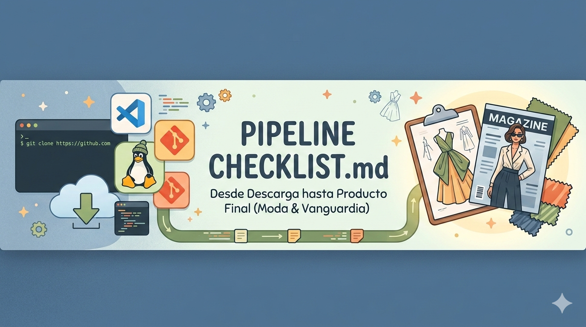
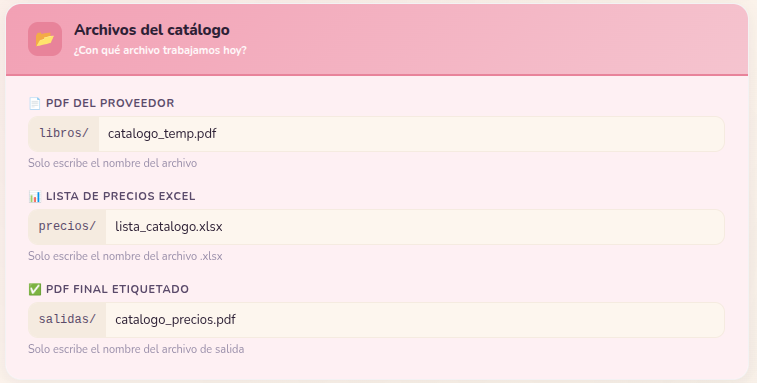
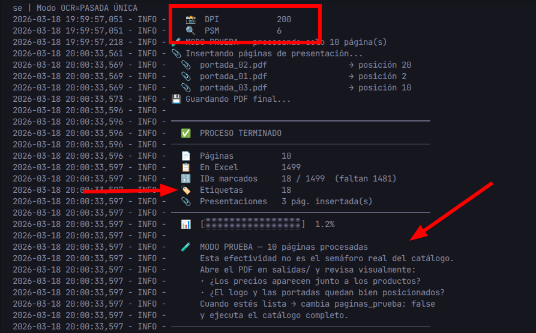
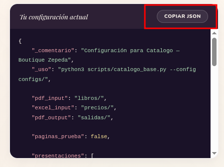
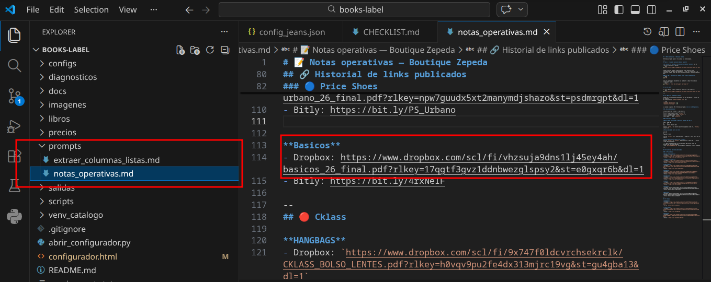
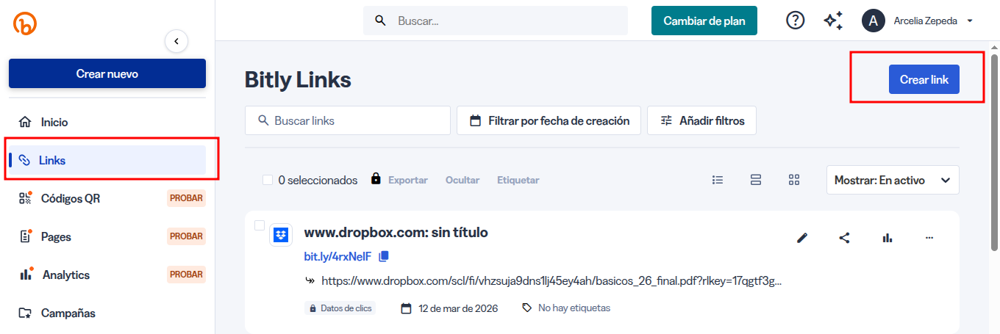
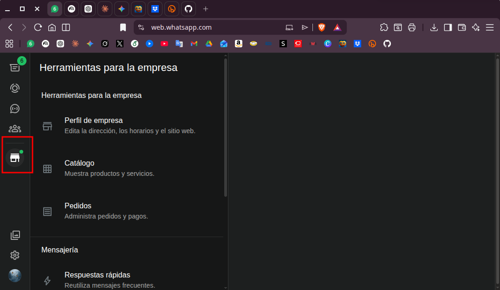

# ✨ Guía de Etiquetado — Boutique Zepeda

> Cada catálogo que etiquetas representa tiempo liberado y calidad entregada.
> Sigue los pasos en orden — el proceso está diseñado para cuidarse solo.

---

## 🗺️ ¿En qué etapa estoy?

```
FASE 1               FASE 2               FASE 3
Extraer precios  →  Etiquetar       →   Publicar
del proveedor        catálogo            al cliente
```

> **Nota:** La Fase 1 está en desarrollo. Por ahora el proceso comienza en la Fase 2.
> Cuando la Fase 1 esté lista, te avisaremos y actualizaremos esta guía.

---

## 🏷️ FASE 2 — Etiquetar el catálogo

> **Objetivo:** ejecutar el script y obtener semáforo verde en el catálogo completo.

### Antes de empezar

- [ ] Verificar que tienes el catálogo PDF en `fase_2/libros/`
- [ ] Verificar que tienes la lista de precios Excel en `fase_2/precios/`
- [ ] Ejecutar sync para bajar los cambios más recientes:
  ```bash
  cd ~/books-label
  ./sync.sh
  ```
- [ ] Activar el entorno:
  ```bash
  source venv_catalogo/bin/activate
  ```

---

### Preparar la configuración

- [ ] Crear una copia de `fase_2/config/config_base.json`. Desde **Dolphin**: seleccionar el archivo, `Ctrl+C` → `Ctrl+V` — el sistema genera la copia automáticamente.
- [ ] Renombrar la copia con `F12` siguiendo la convención:
  `config_<proveedor>_<temporada>.json`
  — Ejemplo: `config_importados_26.json`

- [ ] Abrir el configurador haciendo doble clic sobre:
  ```
  fase_2/config/configurador.html
  ```

  En el configurador, lo primero que debes elegir es el **proveedor**:

  | Proveedor | Elige en el menú |
  |-----------|-----------------|
  | Price Shoes | PS |
  | Pakar | Pakar |
  | Cklass | Cklass |
  | Otro | Otro |

- [ ] Actualizar los tres campos de archivos en el configurador:



---

### Etapa 1 de pruebas — Posicionamiento visual

> **Objetivo:** que la etiqueta de precio aparezca junto al ID del producto.

- [ ] Activar modo prueba con **20 páginas**.
- [ ] Mantener las carátulas en `false` durante esta etapa.
- [ ] Copiar el JSON del configurador y pegarlo en tu archivo de configuración en VSC.
- [ ] Ejecutar el script:
  ```bash
  python3 fase_2/catalogo_base.py --config fase_2/config/<nombre_config>.json
  ```
- [ ] Abrir el PDF generado en `fase_2/salidas/` y verificar visualmente:
  - ¿El precio aparece junto al ID del producto?
  - ¿El logo aparece en el lugar correcto?
- [ ] Ajustar posición en el configurador hasta que se vea bien. Copiar JSON y pegar.

---

### Etapa 2 de pruebas — Optimización de lectura

> **Objetivo:** encontrar la combinación de parámetros que detecta más IDs.

- [ ] Mantener modo prueba activo. Usar entre **30 y 40 páginas**.
- [ ] Desactivar doble pasada durante esta etapa.
- [ ] Probar entre 4 y 8 combinaciones. Tabla de referencia:

| # | DPI | PSM | Doble pasada | Invertir | Cuándo usarla |
|---|:---:|:---:|:------------:|:--------:|---------------|
| 1 | 200 | 6 | ❌ | ❌ | Punto de partida — catálogo limpio |
| 2 | 200 | 11 | ❌ | ❌ | IDs dispersos o fotos de página completa |
| 3 | 200 | 4 | ❌ | ❌ | Catálogo en columnas de texto |
| 4 | 250 | 6 | ❌ | ❌ | PDF de baja resolución |
| 5 | 250 | 11 | ❌ | ❌ | IDs dispersos con más resolución |
| 6 | 300 | 11 | ❌ | ❌ | Máxima resolución |
| 7 | 250 | 11 | ❌ | ✅ | IDs en texto blanco sobre fondo oscuro |

- [ ] El dato clave de cada corrida es **Etiquetas** — no el porcentaje.



- [ ] Registrar los resultados. Los logs se guardan en `fase_2/diagnosticos/`.



---

### Etiquetado final

> **Objetivo:** procesar el catálogo completo con la configuración ganadora.

- [ ] Configurar las carátulas con sus posiciones definitivas:

```json
"presentaciones": [
    {"path": "../imagenes/logos/portada_01.pdf", "posicion": 2},
    {"path": "../imagenes/logos/portada_02.pdf", "posicion": 25},
    {"path": "../imagenes/logos/portada_03.pdf", "posicion": 150},
    {"path": "../imagenes/logos/portada_04.pdf", "posicion": false},
    {"path": "../imagenes/logos/portada_05.pdf", "posicion": -1}
]
```

> Posición `2` = segunda página · `-1` = última página · `false` = desactivada

- [ ] Desactivar modo prueba y activar doble pasada:
```json
"paginas_prueba": false,
"ocr_doble_pasada": true
```

- [ ] Copiar JSON del configurador y pegar en el archivo de configuración.
- [ ] Ejecutar el script:
  ```bash
  python3 fase_2/catalogo_base.py --config fase_2/config/<nombre_config>.json
  ```

---

### Leer el semáforo

| Resultado | Acción |
|-----------|--------|
| 🟢 **VERDE** — 85% o más | Revisar el PDF visualmente y continuar a Fase 3 |
| 🟡 **AMARILLO** — 65% a 84% | Revisar el PDF y evaluar si se requiere un ajuste |
| 🔴 **ROJO** — menos de 65% | No publicar — ver sección siguiente |

- [ ] Ejecutar el diagnóstico al terminar:
  ```bash
  python3 fase_2/diagnostico.py
  ```
  Copiar el output y compartirlo con Gabriel si el semáforo no es verde.

---

### Si el semáforo no es verde

**Camino A — Ajuste autónomo**
- [ ] Abrir el configurador, ajustar parámetros, copiar JSON y ejecutar de nuevo.

**Camino B — Diagnóstico con Claude**
- [ ] Ejecutar `python3 fase_2/diagnostico.py`
- [ ] Pegar el output en Claude: *"Este es el diagnóstico de mi script, ¿qué parámetros recomiendas?"*

**Camino C — Escalar a Gabriel**
- [ ] Aplica cuando A y B no superan el 70%.
- [ ] Compartir el PDF, el log de consola y las combinaciones ya probadas.

> Tu responsabilidad concluye al ejecutar el diagnóstico y completar las iteraciones. Si después de ese proceso la tasa sigue por debajo del 70%, se escala.

---

## 📲 FASE 3 — Publicar al cliente

> **Estado:** canal actual es Dropbox + WhatsApp Business.
> Se evalúa migrar a GitHub Pages o portal web para visualización directa.

### Mover el archivo

- [ ] Copiar el PDF final desde `fase_2/salidas/` al directorio de la marca:
  ```
  ~/boutique_zepeda/<marca>/catalogos_etiquetados/
  ```

### Subir a Dropbox

- [ ] Subir a 🗳️ Dropbox: `Inicio > <marca> > catalogos`
- [ ] Copiar el enlace generado.
- [ ] Pegar en VSC en el archivo `~/books-label/prompts/notas_operativas.md`
- [ ] Cambiar el último carácter del enlace: `0` → `1`



### Comprimir el enlace

- [ ] Entrar a [bitly.com](https://bitly.com) → `Create new` → pegar el enlace modificado.



> 🥺 Bitly tiene límite mensual. Contamos con 3 cuentas — si se agotan, usar el enlace largo directamente.

- [ ] Copiar el enlace corto y pegarlo en `notas_operativas.md`.

### Crear el artículo en WhatsApp Business

- [ ] Capturar 10 recortes del catálogo con **Flameshot**. Guardar en:
  `~/boutique_zepeda/<marca>/carrusel` con nombres `1.png, 2.png, ..., 10.png`

- [ ] Desde **WhatsApp Business Desktop**: `Herramientas > Catálogo > Añadir artículo nuevo`



- [ ] Cargar las 10 capturas.
- [ ] Completar los campos:
  - **Nombre:** nombre del catálogo o proveedor
  - **Descripción:**
    ```
    Da clic en el enlace 👇 para descargar el catálogo, espera o confirma la descarga. ✅️ Revisa tu carpeta de descargas.
    ```
  - **Enlace:** pegar el link de Bitly → **Guardar**

---

> **Nota — WhatsApp Business en móvil**
>
> Si la aplicación de escritorio falla, usar el dispositivo Android. Las imágenes están en:
> ```
> Almacenamiento interno > Android > media > com.whatsapp > WhatsApp > Media > WhatsApp Images > Sent
> ```

---

## 🆘 Árbol de decisión ante resultados adversos

```
¿El semáforo fue amarillo o rojo?
        ↓
Revisar el PDF — ¿el problema es visible?
   ↙                        ↘
  Sí                          No
  ↓                            ↓
Ajustar parámetros         Ejecutar diagnostico.py
en el configurador         y compartir output con Claude
```

> El proceso está diseñado para acompañarte en cada paso.
> Cualquier duda es válida — consultar siempre es la decisión correcta.

---

## 🔄 Sincronización con Gabriel

Siempre ejecutar sync **antes de empezar** y **al terminar** el trabajo del día:

```bash
cd ~/books-label
./sync.sh
```

El script protege automáticamente tu versión de `tabla_precios.ods` — tu archivo siempre tiene prioridad.

---

*Última revisión: 03-2026 · books-label*
