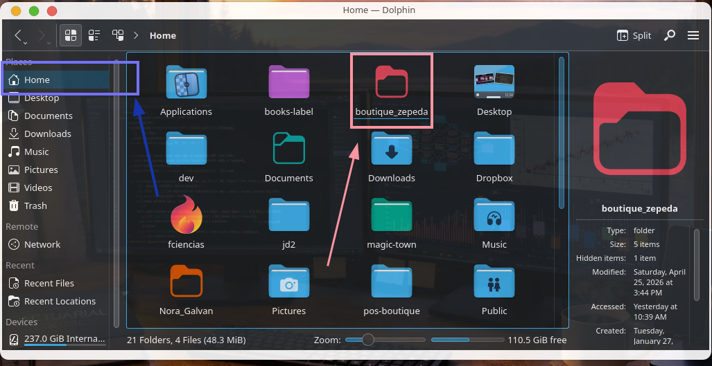
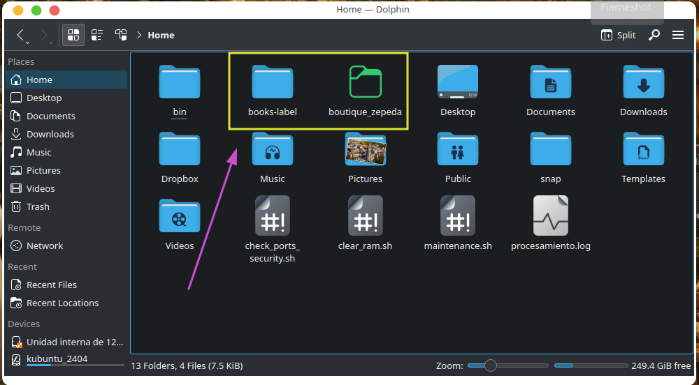
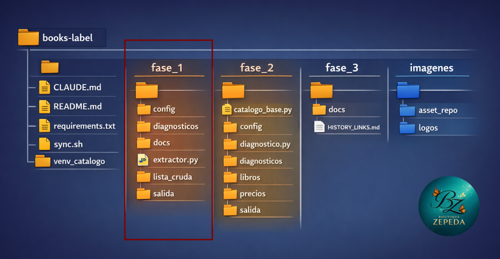
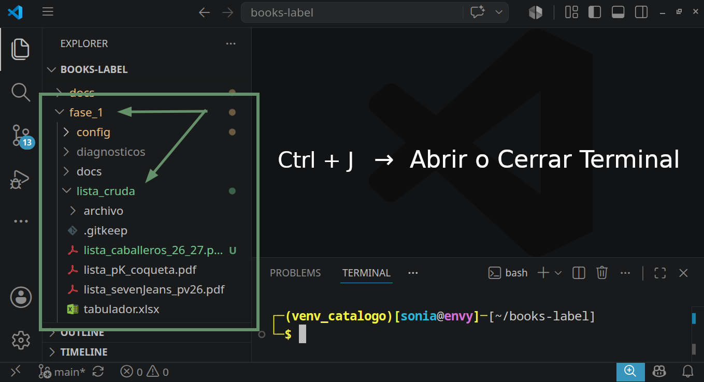
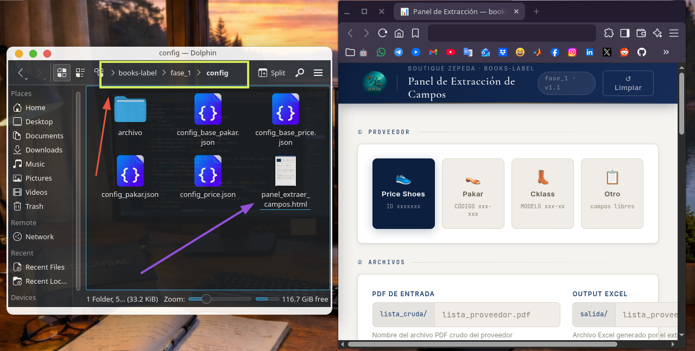
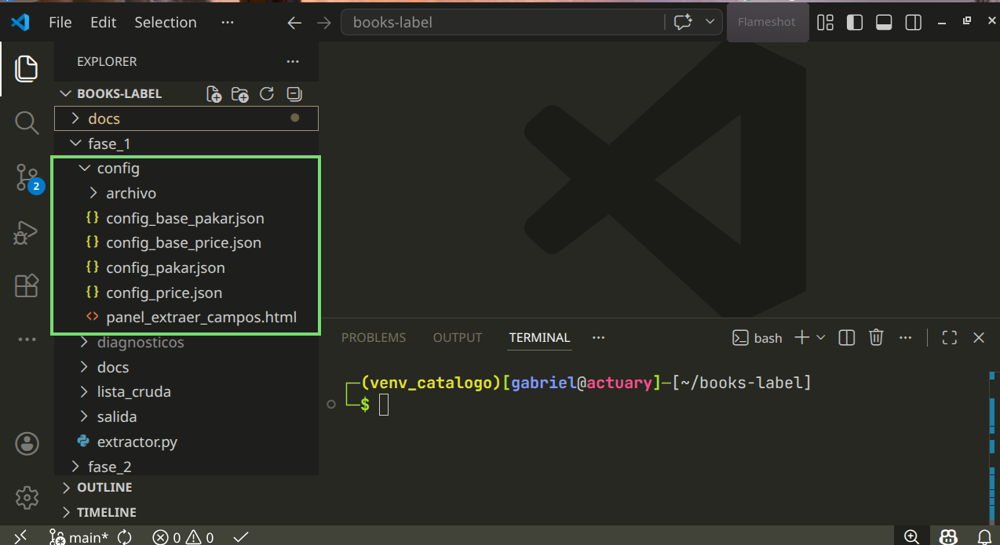
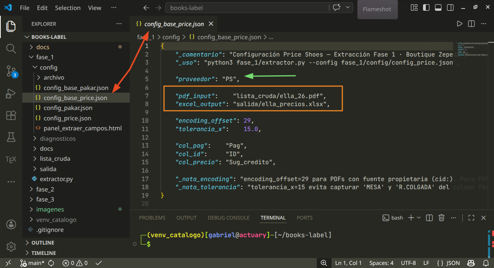
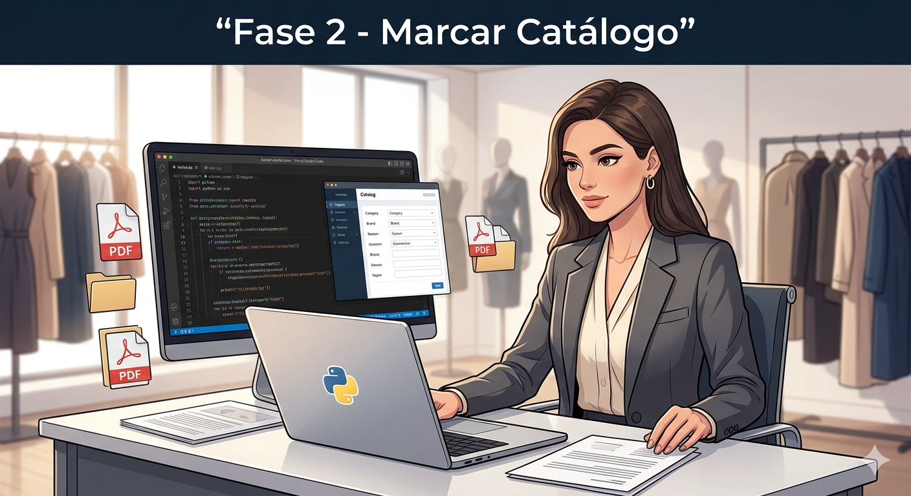
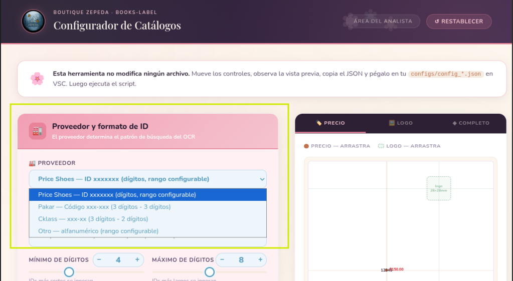

<div align="center">

</div>

# ✨ Guía de Etiquetado — Boutique Zepeda

> Cada catálogo que etiquetas representa tiempo liberado y calidad entregada.
> Sigue los pasos en orden — el proceso está diseñado para cuidarse solo.

---

## 🗺️ ¿En qué etapa estoy?

```
FASE 1               FASE 2               FASE 3
Extraer precios  →  Etiquetar       →   Publicar
del proveedor        catálogo            al cliente
```

<div align="center">
  
</div>

## Fase 1

El módulo está diseñado para ejecutarse de forma automática, iniciando en la extracción de precios hasta la aplicación de precios de nuestra tienda para cada catálogo. No obstante, se seguirá contemplando un plan de contingencia que incluye la extracción mediante LLMs (como NotebookLM de Google o Claude de Anthropic).

- [Extractor.py](#extractor-py)
- [NotebookLM](#notebook)

Para ambos métodos siempre iniciamos descargando los _catálogos_ y _listas de precios_ de cada proveedor en el directorio 📁 `~/boutique_zepeda/<proveedor>/`:

+ **Price Shoes**: 👉 https://www.priceshoes.com/ $\to$ 📥 Download
+ **Pakar**:  📱 app móvil $\to$ compartir a Whatsapp $\to$ 📥 Download
+ **Cklass**: Se consiguen por combo con una lista de precios para todos los catálogos.

<div align="center">

</div>

### <a name="extractor-py"></a>Opción 1 (recomendada). Extractor.py

- [ ] Validar en patalla 🖥️ que el catálogo y la lista descargados coincidan en `ID`, `páginas`, `precio`.
- [ ] Hacer una copia de `~/boutique_zepeda/<proveedor>/catalogos` a `~/books-label/fase_1/libros`

```bash
cp ~/boutique_zepeda/<proveedor>/catalogos/<catalogo_temp.pdf> ~/books-label/fase_2/libros/
cp ~/boutique_zepeda/<proveedor>/lista_precios/<lista_catalogo_temp.pdf> ~/books-label/fase_1/lista_cruda/
```

<div align="center">

</div>

#### Modulo 1 = Extraer precios del proveedor (PDF) + Aplicar nuestra tabla de precios

- [ ] Ya con la lista descarga y copiada en `~/books-labels/fase_1/lista_cruda`:

```
VSC > File > Open Folder > books-label > Open > fase_1
```

- [ ] Activar el virtual environment `venv`. Para mostraur u oculatar la terminal, puedes usar: `Ctrl + J`

```bash
source venv_catalogo/bin/activate
```
El proyeecto se ha vuelto algo robusto, por lo que te sugiero que uses un módulo a la vez, de momento nos encontramos en el modulo_1 - fase_1.

<div align="center">

</div>

- [ ] Debe verse reflejado el fichero `lista_cruda.pdf` en el directorio `../fase_1/liista_cruda/` y el `venv` activado.

<div align="center">

</div>

#### Declarar inputs por medio de JSON (Java Script Object Notation).

La asignación de: `proveedor`, `lista_cruda`, `salida` puedes hacerla con el uso de un panel en el directorio `~/books-label/fase_1/config/panel_extraer_campos.html`, tu decides si usarlo.

- [ ] Usar el panel (Opcional). Da doble click 🖱️ para abrir el panel `panel_extraer_campos.html`

<div align="center">

</div>

- [ ] LLenamos los campos:

  - `proveedor`: <price_shoes, pakar, cklass, otro>
  - `lista_cruda`: <lista_catalogo_temp.pdf>
  - `salida`: <lista_catalogo_temp.xlsx>
  - `tolerancia_col_X`: dejamos la que tiene por defecto

- [ ] Damos click a `COPY JSON`
- [ ] Pegamos la configuración JSON en el fichero correspondiente: `/fase_1/config_price.json`, `/fase_1/config_pakar.json`, `/fase_1/config_cklass.json`.

<div align="center">

</div>

- [ ] Si quieres editar el fichero `../fase_1/<config_proveedor.json>` directamente (sin el panel) sientente con la libertad de hacerlo, el panel es un auxiliar, no influye en el proceso. 

<div align="center">

</div>

- [ ] Ejecuta el fichero `extractor.py` con su configuración conrrespondiente para este módulo. Obtendras un par de tablas:

```bash
python3 fase_1/extractor.py --config fase_1/config/<config_proveedor.json>
```

- [ ] El output en la terminal te dira si la extracción fue exitosa, si es asi, revisa y valida los datos en la carpeta: `~/books-laber/fase_1/salida/<lista_catalogo_temp.xlsx>`. Tenemos cierta confianza de que la extracción es correcta, por lo que con revisar que las paginas coincidan con las del catálogo es suficiente. No hay por que hacer mas revisiones. 
- [ ] También te genera un segundo fichero `/fase_2/precios/<lista_catalogo_temp.xlsx>` con esto **termina el modulo 1**, es decir, el output de fase_1 se convierte en uno de los dos inputs de fase_2.

### <a name="notebook"></a>Opción 2. NotebookLM

Este es el método largo e incocistente, solo recurrimos a él en caso de que el método 1 no de la extracción correcta. El flujo es el siguiete:

1. Insertar fichero en Claude o NotebookLM.
2. Usar los prompt que aparecen a continuación en ese orden.
3. Copiar la extracción a precios_tabla.ods
4. Aplicar las formulas `redondear`, `aplicar_precios`, extraer columnas `ID`, `precio_venta`

- [ ] Validar en patalla 🖥️ que el catálogo y la lista descargados coincidan en_ID_`, _páginas_.
- [ ] Inserta tu lista cruda de precios en alguno de los 2 LLM que han dado mejor reusltado: `Claude` o `NotebookLM (Google)`
- [ ] Usa uno o varios de los siguietnes prompts:

---

#### 🔵 Extracción para Price Shoes

**Paso 1 — Extracción inicial**

```
Del fichero <nombre_archivo> extrae las siguientes columnas de todas las páginas del documento:

{
  "columna_1":  "Pag",
  "columna_4":  "ID",
  "columna_12": "Sug_credito"
}

Preséntala en forma de tabla, lista para copiar y pegar en LibreOffice Calc.
IMPORTANTE: el tipo de datos debe ser número y el formato debe ser una tabla.
```

---

**Paso 2 — Si se equivoca de columna**

```
Del fichero <nombre_archivo> extrae las siguientes columnas de todas las páginas del documento:

{
  "columna_1":  "Pag",
  "columna_4":  "ID",
  "columna_13": "Sug_credito"
}


La columa "Sug_credito" es la siguiete de la que me estas dando en tu último output.
Preséntala en forma de tabla, lista para copiar y pegar en LibreOffice Calc.
IMPORTANTE: el tipo de datos debe ser número y el formato debe ser una tabla.
```

---

**Paso 3 — Si vuelve a equivocarse (este es común para NotebookLM)**

```
La tabla que generaste es correcta en:

{
  "columna_1": "Pag",
  "columna_4": "ID"
}

Es incorrecta la última columna. Corrígela por los datos correctos: "columna_X": "Sug_credito", es la siguiete columna de la que me estas dando en tus últimos outputs.
IMPORTANTE: los datos de toda la tabla deben ser de tipo número.
```

---

#### 🟡 Extacción de Pakar

```
Del fichero <nombre_archivo> extrae las siguientes columnas de todas las páginas del documento:

{
  "columna_1":  "PÁG.",     // type: numeric
  "columna_2":  "CÓDIGO",   // type: "text"
  "columna_11": "2 PAGOS"   // type: numeric
}

IMPORTANTE: El tipo de datos para "CÓDIGO" debe ser texto, es decir, los valores tienen este formato "xxx-xxx". Para "2 PAGO" el formato debe ser número ya que debo aplicarle fórmula en Calc. Tu output tiene que ser una tabla lista para copiar y pegar.
```

---

#### 🔴 Extacción para Cklaas

```
Del fichero <nombre_archivo> extrae las siguientes columnas de todas las páginas del documento:

{
  "columna_1":  "PÁGINA",     // type: numeric
  "columna_2":  "MODELO",     // type: "text"
  "columna_3":  "CLAVE",      // type: numeric
  "columna_6": "CRÉDITO",     // type: numeric
  "columna_7": "NUMERACIÓN"   // type: "text"
}

Preséntala en forma de tabla, lista para copiar y pegar en LibreOffice Calc.
IMPORTANTE: el tipo de datos debe ser número y el formato debe ser una tabla.
```

---

- [ ] Valida que la tabla es la que necesitas Vs tu tabla cruda.
- [ ] Copia tu tabla extraida en `~/books-label/fase_2/precios/precios_tabla.ods`
- [ ] Aplica las transformaciones `REDONDEAR`, `precios_venta`, `LEN`
- [ ] Copia las columnas `ID`, `precio_venta` en una tabla al costado de la transformada con `pegado especial`
- [ ] Pega esas columnas en un fichero nuevo:

```
File > New > Spreadsheet > Paste A1 > Save As > ~/books-label/fase_2/precios/<lista_catalogo_temp.xlsx>
```

---

<div align="center">

</div>

## 🏷️ FASE 2 — Etiquetar el catálogo

> **Objetivo:** ejecutar el script y obtener semáforo verde en el catálogo completo.

Al final de la **fase 1** obtuvimos el output `../fase_2/precios/<lista_cat_tem.xlsx>`, este fichero se convierte en uno de los 2 inputs en este módulo.

- [ ] Verificar que tienes el catálogo PDF en: `../fase_2/libros/<catalogo_temp.pdf>`, te comparto el comando para copiarlo.

```
cp ~/boutique_zepeda/proveedor/catalogos/<marca_temp.pdf> ~/books-label/fase_2/libros/
```

- [ ] Al abrir **VSC** los inputs deben verse reflejados en: `../fase_2/libros/`, `../fase_2/precios/`. el fichero `lista_catalogo_temp.xlsx` se genera automáticamente, solo debes colocar el `catalogo_temp.pdf` en su directorio.

```
VSC > File > Open Folder > books-label > Open > fase_2
```

<div align="center">

</div>


- [ ] Verica que el virtual environment este activado al mostrar la terminal: `Ctrl + J`
  
  ```bash
  source venv_catalogo/bin/activate
  ```

---

### Preparar la configuración

- [ ] Crear una copia de `../fase_2/config/config_base.json`. Desde el panel de directorios de **VSC** o desde **Dolphin**, al hacer: `Ctrl+C` $\to$ `Ctrl+V` en cualquiera de los dos, la copia se genera en automático.
- [ ] Renombrar la copia con `F2`:
  `config_<proveedor>_<temporada>.json`
- [ ] Abrir el configurador haciendo doble clic sobre:

  ```
  ~/books-label/fase_2/config/configurador.html
  ```

  Elige el **proveedor** primero — determina el patrón de búsqueda del OCR.

<div align="center">

</div>

- [ ] Completar los tres campos I/O (inputs / outputs).

<div align="center">

</div>

- [ ] Hacer `COPY JSON` del configurador y pegarlo en tu archivo de configuración en VSC.

---

### Etapa 1 de pruebas — Logo, etiquetas, combinación de parámetros.

> Colocar el logotipo preferentemente en la parte superior de la portada, alineado con los demás elemenetos 
> La etiqueta de precio aparezca cerca al ID del producto, visible y lo menos empalmada posible.
> Aprovecha estas pruebas para hacer combinación de parámetros: dpi, psm.

- [ ] Activar modo prueba con **21 páginas**.
- [ ] Mantener las carátulas en `false` durante esta etapa.
- [ ] El color de la etiqueta debe ser 🔵 **azul**

```
"etiqueta_color_rgb":   [0.00, 0.00, 1.00],
```

- [ ] Ejecutar el script:
  ```bash
  python3 fase_2/catalogo_base.py --config fase_2/config/<nombre_config.json>
  ```
- [ ] Abrir el PDF en `../fase_2/salidas/` y verificar visualmente si los cambios están reflejados.
- [ ] Ajustar posición en el configurador si es necesario. Copiar JSON y pegar o cambiar parámetros directamente en el editor de **VSC**.

---

#### 🚨 El catálogo se imprimio en blanco y negro

Si el libro despues de pasar por el ejecutable `../catalogo_base.py` notas que se ve en blanco y negro. Entonces es necesario ejecutar el siguiente comando en terminal en:`~/books-label`

Antes de ejecutar edita el libro que vas a convertir:

```text
<catalogo_temp_rgb.pdf> por nombre del catalogo corregido
<catalogo_temp.pdf> por el nombre del catalogo corrupto
```

```
gs -dBATCH -dNOPAUSE -dQUIET \
   -sDEVICE=pdfwrite \
   -dCompatibilityLevel=1.4 \
   -dColorConversionStrategy=/sRGB \
   -dProcessColorModel=/DeviceRGB \
   -sOutputFile=fase_1/libros/<catalogo_temp_rgb.pdf> \
   fase_1/libros/<catalogo_temp.pdf>
```

---

### Etapa 2 de pruebas — Optimización de lectura

> **Objetivo:** encontrar la combinación de parámetros que detecta más IDs.

- [ ] Mantener modo prueba activo. Usar entre **20 a 30 páginas**.
- [ ] Desactivar doble pasada durante esta etapa.
- [ ] Probar entre 4 y 8 combinaciones. Tabla de referencia:

| # | DPI | PSM | Doble pasada | Cuándo usarla |
|---|:---:|:---:|:------------:|---------------|
| 1 | 200 | 6 | ❌ | Punto de partida — catálogo limpio |
| 2 | 200 | 11 | ❌ | IDs dispersos o fotos de página completa |
| 3 | 200 | 4 | ❌ | Catálogo en columnas de texto |
| 4 | 250 | 6 | ❌ | PDF de baja resolución |
| 5 | 250 | 11 | ❌ | IDs dispersos con más resolución |
| 6 | 300 | 11 | ❌ | Máxima resolución |
| 7 | 250 | 11 | ❌ | IDs en texto blanco sobre fondo oscuro |

- [ ] El dato clave de cada corrida es **Etiquetas** — no el porcentaje.
- [ ] Registrar los resultados. Los logs se guardan en `fase_2/diagnosticos/`.
- [ ] Si ya encontraste la mejor combinación entre `dpi`, `psm`, puedes intentar cambiar `constraste`, `nitidez` como prueba final (no garantiza mejora).

```
"contraste":     2.5 → 3.0,
"nitidez":       2.0 → 2.5,
```
---

### Etiquetado final

> **Objetivo:** procesar el catálogo completo con la configuración ganadora.

- [ ] Configurar las carátulas con sus posiciones definitivas:

```json
"presentaciones": [
    {"path": "../imagenes/logos/portada_01.pdf", "posicion": 2},
    {"path": "../imagenes/logos/portada_02.pdf", "posicion": 3},
    {"path": "../imagenes/logos/portada_03.pdf", "posicion": 150},
    {"path": "../imagenes/logos/portada_04.pdf", "posicion": 250},
    {"path": "../imagenes/logos/portada_05.pdf", "posicion": -1}
]
```

> Posición `2` = segunda página · `-1` = última página · `false` = desactivada

- [ ] Desactivar modo prueba y activar doble pasada:
```json
"paginas_prueba": false,
"ocr_doble_pasada": true
```

- [ ] Ejecutar el script:
  ```bash
  python3 fase_2/catalogo_base.py --config fase_2/config/<nombre_config.json>
  ```
---

### Leer el semáforo

| Resultado | Acción |
|-----------|--------|
| 🟢 **VERDE** — 85% o más | Revisar el PDF visualmente, listo para publicar en Whatsapp |
| 🟡 **AMARILLO** — 65% a 84% | Si las pruebas has sido exhaustivas, puedes publicar |
| 🔴 **ROJO** — menos de 65% | No publicar — Compartirlo con tu colaborador |

- [ ] Existe un fichero `ocr_diagnostico.sh` que puede tratar de encontrar el por que no lee el `ID`, si la tasa es baja (semaforo rojo) pidele a Gabriel que lo revise. 

---

## 📲 FASE 3 — Publicar al cliente

> **Estado:** canal actual es Dropbox + WhatsApp Business.
> Se evalúa migrar a GitHub Pages o portal web para visualización directa.

⚠️ Módulo en desarrollo, no hay algo que hacer para esta etapa

### Mover el archivo

- [ ] Copiar el PDF final desde `fase_2/salidas/` al directorio de la marca:
  ```
  ~/boutique_zepeda/<marca>/catalogos_etiquetados/
  ```

### Subir a Dropbox

- [ ] Subir a 🗳️ Dropbox: `Inicio > <marca> > catalogos`
- [ ] Copiar el enlace generado.
- [ ] Pegar en VSC en el archivo `~/books-label/prompts/notas_operativas.md`
- [ ] Cambiar el último carácter del enlace: `0` → `1`

### Comprimir el enlace

- [ ] Entrar a [bitly.com](https://bitly.com) → `Create new` → pegar el enlace modificado.

> 🥺 Bitly tiene límite mensual. Contamos con 3 cuentas — si se agotan, usar el enlace largo directamente.

- [ ] Copiar el enlace corto y pegarlo en `notas_operativas.md`.

### Crear el artículo en WhatsApp Business

- [ ] Capturar 10 recortes del catálogo con **Flameshot**. Guardar en:
  `~/boutique_zepeda/<marca>/carrusel` con nombres `1.png, 2.png, ..., 10.png`

- [ ] Desde **WhatsApp Business Desktop**: `Herramientas > Catálogo > Añadir artículo nuevo`
- [ ] Cargar las 10 capturas.
- [ ] Completar los campos:
  - **Nombre:** nombre del catálogo o proveedor
  - **Descripción:**
    ```
    Da clic en el enlace 👇 para descargar el catálogo, espera o confirma la descarga. ✅️ Revisa tu carpeta de descargas.
    ```
  - **Enlace:** pegar el link de Bitly → **Guardar**

> **Nota — WhatsApp Business en móvil**
>
> Si la aplicación de escritorio falla, usar el dispositivo Android. Las imágenes están en:
> ```
> Almacenamiento interno > Android > media > com.whatsapp > WhatsApp > Media > WhatsApp Images > Sent
> ```

---

## 🆘 Árbol de decisión ante resultados adversos

```
¿La extracción o el semáforo no son verdes?
              ↓
  Revisar el output en consola — ¿el error es claro?
       ↙                              ↘
      Sí                               No
      ↓                                 ↓
  Ajustar config               Ejecutar diagnostico.py
  y volver a intentar          y compartir con Claude
```

> El proceso está diseñado para acompañarte en cada paso.
> Cualquier duda es válida — consultar siempre es la decisión correcta.

---

## 🔄 Sincronización con Gabriel

Siempre ejecutar sync **antes de empezar** y **al terminar** el trabajo del día.
Desde **Tilix** o la terminal integrada de VSC:

```bash
cd ~/books-label && ./sync.sh
```

El script protege automáticamente tu versión de `tabla_precios.ods` — tu archivo siempre tiene prioridad.

---

*Última revisión: 03-2026 · books-label*
