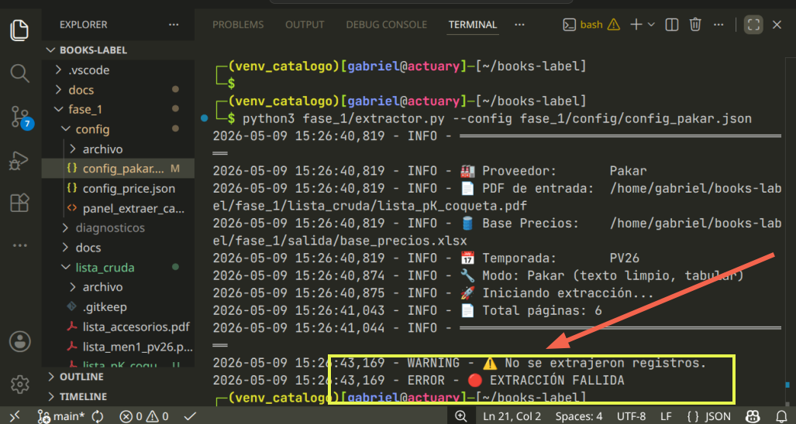
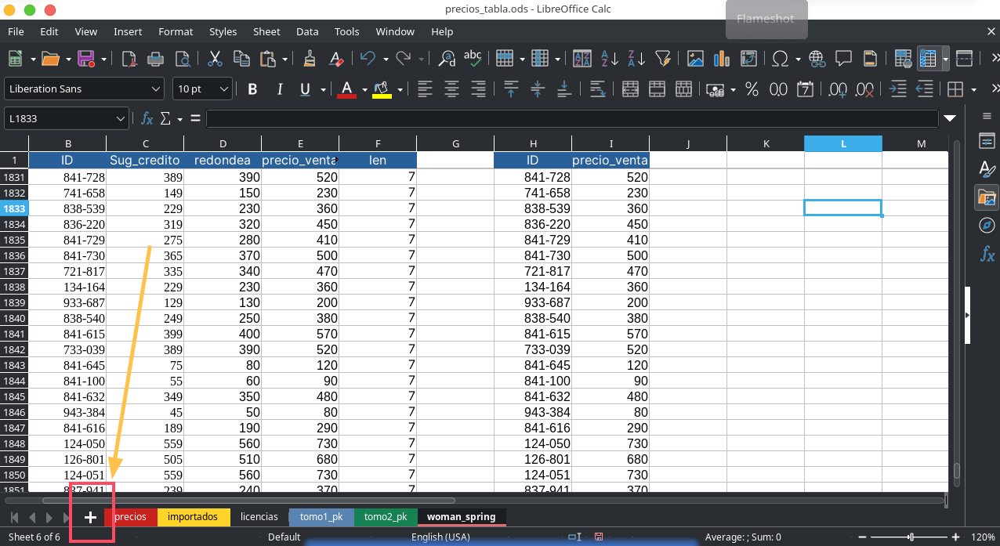
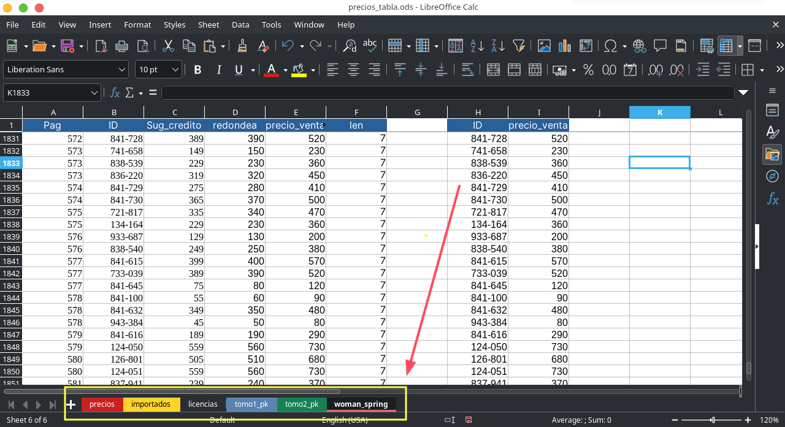
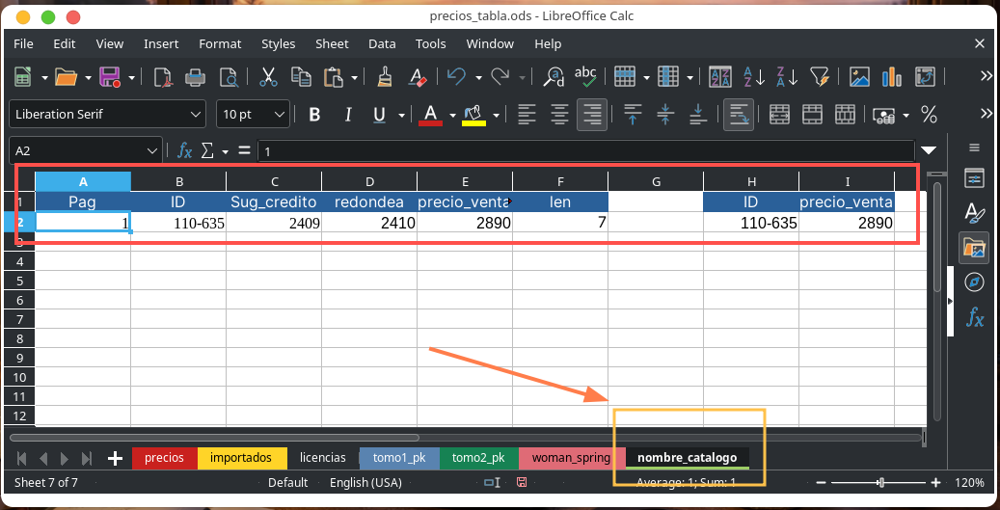
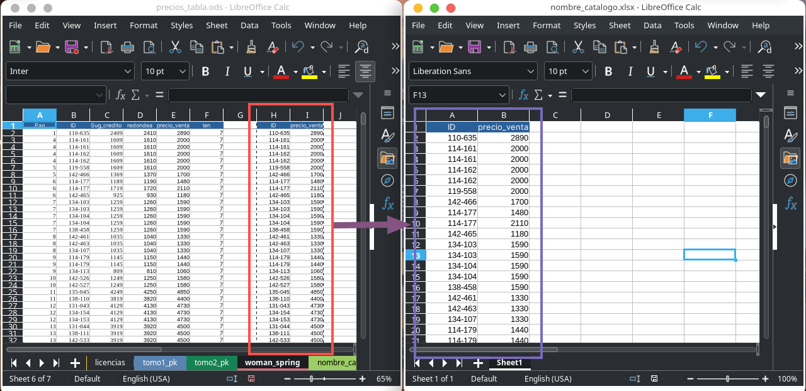

## Extraer precios sin script

> Este es un documento alterno para los casos en que el ejecutar `extractor.py`da `ERROR`.

<div align="center">

</div>

- [ ] Elegimos algún LLM

<div align="center">

</div>

- [ ] Adjuntamos el fichero `catalogo.pdf` como archivo adjunto + prompt

**NOTA**: Los siguientes son plantillas de `prompt`no significa que es el definitivo. De ser necesario ajusta a que `num_columna` le corresponden los 3 campos que hay que extraer:

- **Price Shoes**: `Pag`, `ID`, `Sug_creditio`
- **Pakar**: `PÁG`, `CÓDIGO`, `2 PAGOS`

#### 🔵 Extracción para Price Shoes

**Paso 1 — Extracción inicial**

```
Del fichero <nombre_archivo> extrae las siguientes columnas de todas las páginas del documento:

{
  "columna_1":  "Pag",
  "columna_4":  "ID",
  "columna_12": "Sug_credito"
}

Preséntala en forma de tabla, lista para copiar y pegar en LibreOffice Calc.
IMPORTANTE: el tipo de datos debe ser número y el formato debe ser una tabla.
```

---

**Paso 2 — Si se equivoca de columna**

```
Del fichero <nombre_archivo> extrae las siguientes columnas de todas las páginas del documento:

{
  "columna_1":  "Pag",
  "columna_4":  "ID",
  "columna_13": "Sug_credito"
}


La columa "Sug_credito" es la siguiete de la que me estas dando en tu último output.
Preséntala en forma de tabla, lista para copiar y pegar en LibreOffice Calc.
IMPORTANTE: el tipo de datos debe ser número y el formato debe ser una tabla.
```

---

**Paso 3 — Si vuelve a equivocarse (este es común para NotebookLM)**

```
La tabla que generaste es correcta en:

{
  "columna_1": "Pag",
  "columna_4": "ID"
}

Es incorrecta la última columna. Corrígela por los datos correctos: "columna_X": "Sug_credito", es la siguiete columna de la que me estas dando en tus últimos outputs.
IMPORTANTE: los datos de toda la tabla deben ser de tipo número.
```

---

#### 🟡 Extacción de Pakar

```
Del fichero <nombre_archivo> extrae las siguientes columnas de todas las páginas del documento:

{
  "columna_1":  "PÁG.",     // type: numeric
  "columna_2":  "CÓDIGO",   // type: "text"
  "columna_11": "2 PAGOS"   // type: numeric
}

IMPORTANTE: El tipo de datos para "CÓDIGO" debe ser texto, es decir, los valores tienen este formato "xxx-xxx". Para "2 PAGO" el formato debe ser número ya que debo aplicarle fórmula en Calc. Tu output tiene que ser una tabla lista para copiar y pegar.
```

---

- [ ] Pegamos los datos extraidos en el fichero:

```
~/boutique_zepeda/pto_montaje/books_label_backup/fase2/precios_tabla.ods 
```

<div align="center">

</div>

Al abri el fichero puede verse similar a la siguiete pantalla 👇:

<div align="center">

</div>

- [ ] Damos click en `+` para agregar una nueva hoja.
- [ ] Copia los `rótulos` y la fila `A2` de alguna página anterior, pegalos en la nueva página. El primer registro que copiamos es para copiar las fórmulas

<div align="center">

</div>

- [ ] Aplica las transformaciones `REDONDEAR`, `precios_venta`, `LEN`
- [ ] Copia las columnas `ID`, `precio_venta` en una tabla al costado de la transformada con `pegado especial`
- [ ] Pega esas columnas en un fichero nuevo:

```
File > New > Spreadsheet > Paste A1 > Save As > ~/books-label/fase_2/precios/<lista_catalogo_temp.xlsx>
```
<div align="center">

</div>

- [ ] Al guardar el fichero en `../fase_2/precios` termina la `fase_1` de extracción de precios.